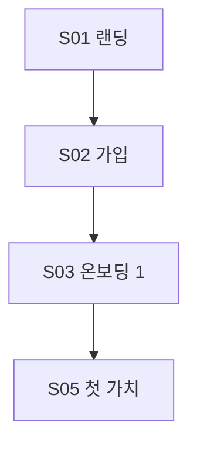

# <아이디어 이름> 블루프린트

- 작성일: YYYY-MM-DD
- 판정: **진행 / 수정 후 진행 / 중단** — <이유 1줄>
- 목표 월 순수익: <금액> (기본 300만 원)

## 0. 입력
| 항목 | 내용 |
|---|---|
| 타깃 | |
| 없애려는 불편 | |
| 수익 방식 | |
| 가정한 것 | `[가정]` 표시 |

## 1. 문제·고객
- 타깃 1명: <직업, 상황, 불편을 겪는 순간>
- 지금 쓰는 대안과 그 비용:
- 불편의 근거:
  1. "<원문 인용>" — [출처](URL)
  2. "<원문 인용>" — [출처](URL)
  3. "<원문 인용>" — [출처](URL)

## 2. 조기 중단 검토

| 구분 | 질문 | 점수(1~5) | 근거 |
|---|---|---|---|
| 필요성 | 없으면 실제로 손해를 보나 | | |
| 필요성 | 지금 대안으로 해결이 안 되나 | | |
| 필요성 | 무료 기능·범용 AI로 대체가 안 되나 | | |
| 필요성 | 불편이 여러 곳에서 반복되나 | | |
| 수익성 | 비슷한 제품이 돈을 받고 있나 | | 가격표 링크 |
| 수익성 | 필요 고객 수를 1년 안에 모을 수 있나 | | 아래 계산 |
| 수익성 | 타깃에 닿을 채널이 있나 | | |
| 수익성 | 돈 내는 사람 = 쓰는 사람인가 | | |

- 필요성 평균: _ / 수익성 평균: _
- 필요 유료 고객 수: 목표 <금액> ÷ (월 가격 <금액> × (1 − <비용 비율>)) = **<N>명**
- 판정 규칙: 필요성 ≤ 2 또는 수익성 ≤ 2 또는 N명을 1년 안에 못 모음 → 중단
- **판정:** <진행 / 수정 후 진행 / 중단>
- (중단·수정일 때) 살릴 수 있는 방향:
  1.
  2.

> 중단이면 문서는 여기까지.

## 3. 수요 신호
- 검색 추이: <네이버 데이터랩 / Google Trends 결과 + 링크>
- 커뮤니티 언급: <횟수, 최근성, 링크>
- 결론: 커지는 중 / 정체 / 줄어드는 중

## 4. 경쟁사·롤모델

### 기능 비교
| 기능 | 경쟁사 A | 경쟁사 B | 경쟁사 C | 우리 |
|---|---|---|---|---|
| | O/X/부분 | | | |

### 가격
| 제품 | 무료 범위 | 유료 가격 | 과금 단위 | 링크 |
|---|---|---|---|---|

### 리뷰 불만 Top 5
1. "<원문>" — [출처](URL)

### 빈칸 (우리 차별점 후보)
-

## 5. 롤모델 UX 해부
| 항목 | 제품 A | 제품 B |
|---|---|---|
| 첫 화면 약속(헤드라인 원문) | | |
| 가입까지 클릭 수·방식 | | |
| 온보딩 질문 수·내용 | | |
| 첫 가치까지 클릭 수·시간 | | |
| 결제 화면 첫 등장 시점 | | |

- 따라 할 것: 1. 2. 3.
- 피할 것: 1. 2. 3.

## 6. 디자인 방향
- 분위기 키워드:
- 참고 제품:
- 색·글꼴 방향:
- design-router용 brief (5줄):

## 7. 첫 출시 범위 (기간: <3주>)
| 묶음 | 기능 | 예상 작업일 | 첫 출시 / 2차 |
|---|---|---|---|
| 핵심 경험 | | | 첫 출시 |
| 차별점 | | | |
| 편의 | | | |
| 성장 장치 | | | |
| **합계** | | <N>일 | |

- 첫 가치까지 클릭 수: <N> (기능이 늘어도 유지)
- 안 함(핵심 흐름과 충돌): 

## 8. 유저 플로우

### 전체 흐름도

### 여정 목표 시간
| 구간 | 목표 | 실제 설계 |
|---|---|---|
| 첫 방문 → 가입 | 30초 | |
| 가입 → 첫 가치 | 2분 | |
| 재방문 계기 | | |
| 결제 전환 시점 | | |
| 공유 시점 | | |

### 화면 카드 (화면마다 반복)

#### S01 <화면 이름>
- 진입 경로:
- 목적: <사용자가 이 화면에서 얻는 것 1줄>
- UI 요소(위→아래):
  1.
- 실제 문구:
  - 헤드라인: "<>"
  - 버튼: "<>"
  - 안내: "<>"
- 행동 → 반응 → 다음 화면:
  - <버튼 클릭> → <처리> → S02
- 상태별 화면:
  - 빈 상태: "<문구>"
  - 로딩:
  - 오류: "<문구>" + 복구 방법
  - 권한 거부:
- 이탈 방지:
- 측정 이벤트: `<event_name>`

### 엣지 케이스
| 상황 | 화면 | 사용자에게 보이는 문구 | 처리 |
|---|---|---|---|
| 네트워크 끊김 | | | |
| 결제 실패 | | | |
| 중복 가입 | | | |
| 무료 한도 도달 | | | |
| 데이터 0개 | | | |

## 9. 초반 입지와 인지도
- 포지셔닝: "<타깃>을 위한 <카테고리>. <경쟁사>와 달리 <차별점>."
- 별칭: "<○○계의 ○○>"
- 선점할 키워드·카테고리: <1~2개 + 근거>
- 제품 안 확산 장치:

### 채널
| 채널 | 올릴 것 | 빈도 | 목표 |
|---|---|---|---|

### 협업 후보
| 이름 | 채널 | 구독자·규모 | 링크 | 제안 내용 |
|---|---|---|---|---|

### 8주 캘린더
| 주차 | 할 일 |
|---|---|
| 출시 -4주 | |
| 출시 -3주 | |
| 출시 -2주 | |
| 출시 -1주 | |
| 출시 주 | |
| +1주 | |
| +2주 | |
| +3주 | |

### 입지 지표
| 지표 | 출시 시점 목표 | +4주 목표 |
|---|---|---|
| 대기자 수 | | |
| 팔로워 | | |
| 브랜드 검색량 | | |
| 커뮤니티 언급 | | |
| 추천 가입 비율 | | |

## 10. 성공 지표와 출시 후 중단 기준
| 지표 | 4주 | 12주 |
|---|---|---|
| 가입자 | | |
| 첫 가치 도달률 | | |
| 유료 전환 | | |
| 월 매출 | | |

- **출시 후 중단 기준:** 12주 시점 월 매출이 <목표의 10% 금액> 미만이고 증가 추세가 아니면 접거나 방향 전환
- 재활용할 것:

## 11. 다음 단계
- [ ] PRD: `doc-coauthoring`
- [ ] 시안: `design-router`
- [ ] 인프라: `stack-advisor`
