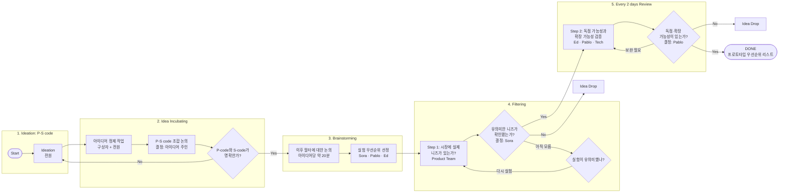

# "될 놈 실험실 Process" 흐름도 복원

- 출처: 릴스 영상 11.5~14.5초 화면(위프 팀의 화이트보드 캡처)
- 읽기 정확도: **단계 이름·상자·분기는 확실**, 상자 아래 작은 글씨는 해상도가 낮아 **일부만 읽힘**. `[흐릿함]`은 추정해서 읽은 부분

## 전체 개요 (확실)
- 제목: 될 놈 실험실 Process
- 전체 소요 시간: 1M ~ 1.5M (1~1.5개월로 보임)
- 결과물: **Prototype을 진행하기 위한 우선순위 리스트 확보**
- 흐름도 읽는 법: 보라색 상자 = 할 일(Step), 초록 마름모 = 질문(판정), Yes → 다음 단계, No → Drop(폐기)
- 상자마다 **목적 / 소요 시간 / Decision Owner(결정권자) / 방식**이 적혀 있음

## 용어
- **P-Code** = Problem 코드: 누가, 어떤 문제를 겪는가 `[흐릿함]`
- **S-Code** = Solution 코드: 그 문제에 대한 해결책과 수익 모델(BM) `[흐릿함]`
- 아이디어 하나 = P-Code × S-Code 조합

## 흐름도

## 단계별 내용

| 단계 | 할 일 | 누가 | 판정 질문 | 떨어지는 이유 |
|---|---|---|---|---|
| 1. Ideation | P-Code·S-Code로 아이디어를 최대한 많이 냄 | 전원 | — | — |
| 2. Incubating | 아이디어 정제 → P-S 조합 논의 | 구상자 + 전원, 결정은 아이디어 주인 | P-Code와 S-Code가 명확한가 | 불명확하면 Ideation으로 되돌림 |
| 3. Brainstorming | 필터 기준 논의(아이디어당 약 20분) → 실험 우선순위 선정 | 리더 3명 | — | 우선순위 밖은 대기 |
| 4. Filtering | 시장 니즈 검증: 정성(인터뷰·유저 리서치·유사 서비스·커뮤니티 조사) + 정량(FDT, CPC 비교, WTP·리드 확보) `[흐릿함]` | Product Team, 결정은 Sora | 유의미한 니즈가 확인됐는가 | Problem 없음, 지불 의사(WTP) 없음 `[흐릿함]` |
| 5. 2일마다 리뷰 | 독점 가능성·확장 가능성 검증 | 사업 + 기술 담당, 결정은 Pablo | 독점·확장 가능성이 있는가 | 해자가 없거나 시장이 작음 |
| DONE | 프로토타입 우선순위 리스트 | — | — | — |

### 5단계 체크리스트 (중간 크기 글씨, 대체로 읽힘)
- **1-1 Easiness (쉽게 따라 할 수 있나)**
  - Business: 같은 문제를 푸는 기업이 쉽게 할 수 있는가, 사용자 확보, 운영 비용, 규제·법적 이슈 `[흐릿함]`
  - Technical: 데이터, 최신 AI 기술로 가능한가, 우리 기술로 가능한가 `[흐릿함]`
- **1-2 Moat (해자)**: 네트워크 효과, 데이터, 독점 기술, 규모의 경제, 브랜드, 전환 비용 `[흐릿함]`
- **2. 확장 가능성**: 시장 규모 → 확장 경로 `[흐릿함]`

## 릴스 음성과 연결
- "순서대로 아이템을 검토하는 깔때기 구조"[00:11] = 위 1→5단계
- FDT(가짜 문 테스트)[00:14~00:35] = 4단계 Filtering의 정량 검증
- "병렬 실험 5~10개"[00:37] = 3단계에서 우선순위를 매긴 아이디어 여러 개를 동시에 4단계에 넣음
